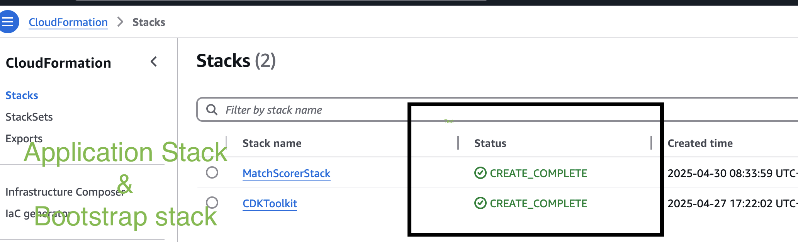
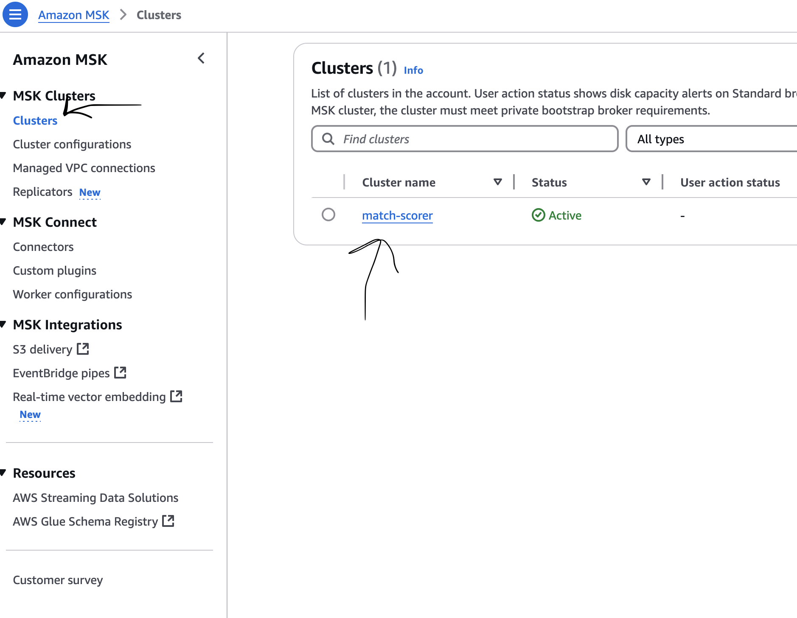
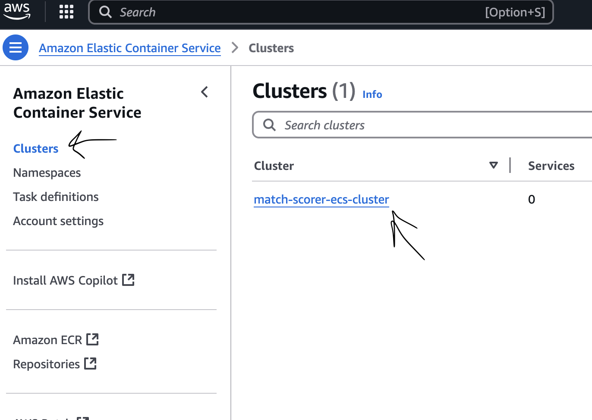
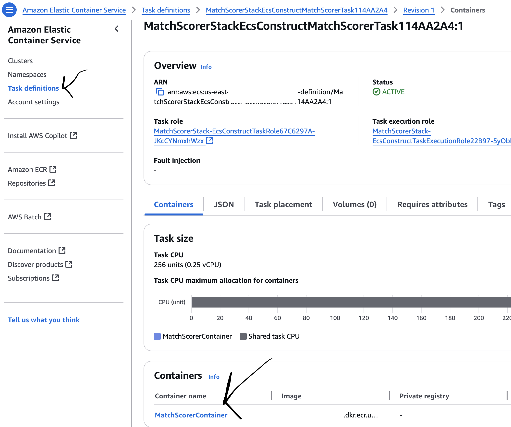
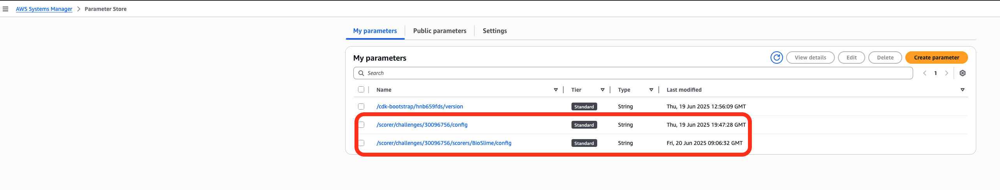
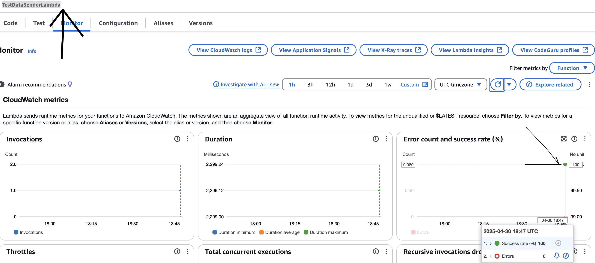
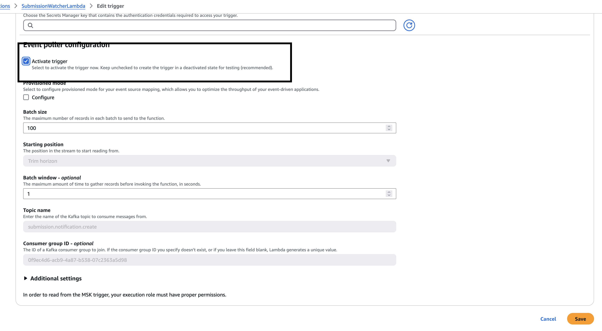
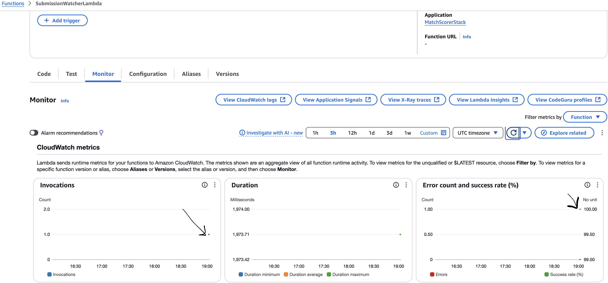
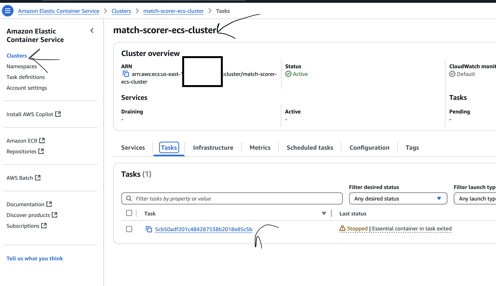
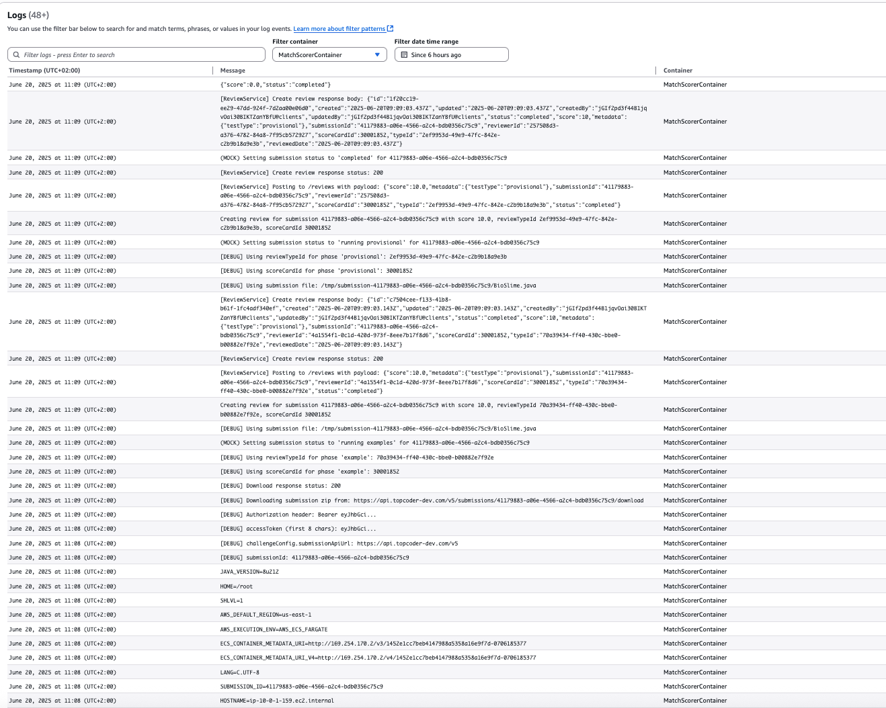

# Match Scorer

A service to fetch and score submissions. This service processes match submissions via Kafka messages and updates their scores through an API.

## Project Structure

```
match-scorer/              # Root directory
├── cdk/                   # CDK infrastructure code (Stack, Constructs, Config)
│   ├── lib/               # CDK Constructs and Stack definition
│   │   ├── config.ts              # Configuration (env vars, challenges)
│   │   ├── match-scorer-cdk-stack.ts  # Main stack
│   │   ├── lambda-constructs.ts   # All Lambda constructs
│   │   ├── dynamodb-construct.ts  # DynamoDB table
│   │   ├── sns-sqs-construct.ts   # SNS/SQS fan-out
│   │   ├── eventbridge-construct.ts # EventBridge rules
│   │   ├── ecs-construct.ts       # ECS cluster/task
│   │   ├── msk-construct.ts       # MSK cluster
│   │   └── vpc-construct.ts       # VPC
│   ├── bin/               # CDK entry point
│   └── cdk.json           # CDK config
├── router-lambda/         # MSK → SNS router (fan-out entry point)
│   ├── index.js
│   └── package.json
├── challenge-processor-lambda/  # SQS → ECS launcher (one per challenge)
│   ├── index.js
│   └── package.json
├── completion-lambda/     # EventBridge → CloudWatch (task completion)
│   ├── index.js
│   └── package.json
├── submission-watcher-lambda/   # Legacy: direct MSK → ECS (kept for reference)
│   ├── index.js
│   └── package.json
├── java-scorer/           # ECS task application code (the scorer)
│   ├── src/
│   ├── Dockerfile
│   └── pom.xml
├── test-data-sender-lambda/     # Lambda to send test messages to MSK
│   ├── index.js
│   └── package.json
├── doc/                   # Documentation assets
├── architecture.md        # Architecture documentation
├── DEPLOYMENT.md          # Deployment guide
├── INFRASTRUCTURE_CONFIG.md # Infrastructure configuration
├── package.json           # Root package.json (npm workspaces)
└── README.md              # This file
```

## Quick Start Guide

### 1. Install Required Tools

#### AWS CLI
```bash
# macOS
brew install awscli

# Windows: Download from https://aws.amazon.com/cli/
# Linux
curl "https://awscli.amazonaws.com/awscli-exe-linux-x86_64.zip" -o "awscliv2.zip"
unzip awscliv2.zip
sudo ./aws/install

# Configure AWS credentials
aws configure
# Enter your AWS Access Key ID, Secret Access Key, region, and output format (use us-east-1 for this poc)
```

#### Node.js
```bash
# Install nvm
curl -o- https://raw.githubusercontent.com/nvm-sh/nvm/v0.39.7/install.sh | bash

# Install Node.js 20 LTS (this is latest version supported by aws cli)
nvm install 20
nvm use 20

# Install CDK CLI
npm install -g aws-cdk
```

#### Docker
```bash
# Install Docker Desktop from:
# - Mac: https://docs.docker.com/desktop/install/mac-install/
# - Windows: https://docs.docker.com/desktop/install/windows-install/
```

### 2. Deploy Infrastructure

The AWS CDK (Cloud Development Kit) is configured to handle building the necessary components (like the Docker image for the ECS task and packaging Lambda code) and deploying all required AWS resources.

**Important Note on Auth0 M2M Token:**

The `ACCESS_TOKEN` used by the Scorer ECS Task is obtained dynamically at runtime via Auth0 M2M flow. Provide these environment variables before deploying:
- `AUTH0_URL`, `AUTH0_AUDIENCE`, `AUTH0_CLIENT_ID`, `AUTH0_CLIENT_SECRET`, `AUTH0_PROXY_URL`

```bash
# Install all dependencies (from root directory)
npm install

# Build CDK
npm run build

# Bootstrap CDK (one-time setup per AWS account/region)
cd cdk && npm run bootstrap && cd ..

# Deploy the stack
npm run deploy

# NOTE: Initial deployment can take up to 30 minutes due to MSK cluster creation.

# Other useful commands (run from root):
npm run synth      # Synthesize CloudFormation template
npm run diff       # Preview changes before deploying
npm run destroy    # Remove all resources
npm run test       # Run tests
npm run lint       # Lint TypeScript code
npm run lint:fix   # Fix linting issues
```

It will take a while to deploy (up to 30 mins), and the cli might get stuck. So confirm a cloudformation stack is created.



### 3. Verify Infrastructure

Open the AWS console and go to `us-east-1` region. Verify following

#### 3.1 Lambda functions

See both lambda functions are deployed


Go inside SubmissionWatcher


You will see trigger is `Disabled`, that's okay. Because topic for submissions is not crated yet. It will be auto created when we send a test message. We will come back and active this. Please keep following and guide will tell you when.
(Adding an extra note here, sometimes I saw it's automatically enabled after the first event is sent)

#### 3.2 MSK

Open MSK Console and confirm there is a cluster.



#### 3.3 ECS Cluster

Verify ECS cluster deployed.



Verify ECS Task Definition



#### 3.4 Auth0 M2M Token

Access tokens are fetched dynamically by the Submission Watcher Lambda from the configured Auth0 proxy at runtime using the M2M client credentials flow. No tokens are stored statically or in Secrets Manager.

#### 3.4 SSM



Configuration for each challenge and scorer is stored in AWS SSM Parameter Store. There are two main parameters per challenge:

1. **Challenge Config** (`/scorer/challenges/{challengeId}/config`):
   - Stores general info about the challenge and which scorers are enabled.
   - Example:
     ```json
     {
       "name": "Marathon Match 160",
       "active": true,
       "scorers": ["BioSlime"],
       "submissionApiUrl": "https://api.topcoder-dev.com/v6",
       "reviewScorecardId": "30001852",
       "reviewTypeName": "MMScorer"
     }
     ```

2. **Scorer Config** (`/scorer/challenges/{challengeId}/scorers/{scorerName}/config`):
   - Stores all configuration for a specific scorer, including the phases to run.
   - Each phase is an object with:
     - `name`: The phase name (e.g., "example", "provisional")
     - `reviewTypeId`: The GUID for the review type (from the Submission API)
     - `scoreCardId`: The scorecard ID to use for this phase
   - Example:
     ```json
     {
       "name": "BioSlime",
       "testerClass": "com.topcoder.challenges.mm160.BioSlimeTester",
       "timeLimit": 10000,
       "timeout": 10000,
       "compileTimeout": 10000,
       "startSeed": 42,
       "numberOfTests": 1,
       "phases": [
         {
           "name": "example",
           "reviewTypeId": "70a39434-ff40-430c-bbe0-b00882e7f92e",
           "scoreCardId": "30001852"
         },
         {
           "name": "provisional",
           "reviewTypeId": "2ef9953d-49e9-47fc-842e-c2b9b18a9e3b",
           "scoreCardId": "30001852"
         }
       ]
     }
     ```

Validate that these parameters are deployed in SSM after running the CDK stack.

### 4. Send Test Message

#### Note

- The test data targets the test MM challange [here](https://www.topcoder-dev.com/challenges/bd958f96-1c76-436a-9daa-8627426b1820)
- This dev challenge already has a submission uploaded, hence the input has the submission id and memberId for the existing submission. 
- If the message details are not valid, you need to find a new challengeId, memberId, submissionId etc.. Please see `Appendix: Find test data` but given test message should be fine. Also see [forum discussion](https://discussions.topcoder.com/discussion/36632/test-challenge-in-dev-environment)

```bash
# --- Send Message via Publisher Lambda ---

# Invoke the publisher Lambda, passing the test message content as the payload
# Go to cdk directory of you are not in it. cd cdk
aws lambda invoke \
  --function-name TestDataSenderLambda \
  --payload file://test-message.json \
  --cli-binary-format raw-in-base64-out \
  output.json \
  --region us-east-1 # Add --profile YOUR_PROFILE_NAME if needed
```  

We use a lambda as gateway because MSK is not publicly accessable, lambda lives inside the same VPC. This is more secure

### 5. Verify Processing (AWS Console)

After sending the test message using the `aws lambda invoke` command above:

#### 1.  **Check Test Message Sender Execution:**

*   Navigate to the AWS Lambda console.
*   Find and click on the `TestDataSenderLambda` function.
*   Go to the **Monitor** tab.
*   Look at the **Invocations** graph; you should see a recent invocation afte few mins you sent the message. (please be patient)
*   Alternatively, click the **View CloudWatch logs** button to go directly to the function's log group (`/aws/lambda/TestDataSenderLambda`) and check for recent log entries indicating it received an event to send a test message.




#### 2.  **Activate MSK Trigger for `SubmissionWatcherLambda`**

**NOTE:** I sometimes saw the triggers gets activated automatically. If that's the case, you can skip activating trigger, and look at submission watcher.

Now that we sent a test message and kafka topic is created, we can activate the trigger.

*   Navigate to the AWS Lambda console.
*   Find and click on the `SubmissionWatcherLambda` function.
*   Go to the **Configuration** tab.
*   Go to the **Triggers**.
*   Select MSK trigger and click **Edit**.
*   Click activate trigger and save
*   Confirm status changes to `Enabling` then `Enabled`. Please be patient because enabling may take 5 mins.



*   Go to Monitor tab, and see `SubmissionWatcherLambda` metric is available in few mins. Earlier test message will automatically be picked up



*   Alternatively, click the **View CloudWatch logs** button to go directly to the function's log group (`/aws/lambda/SubmissionWatcherLambda`) and check for recent log entries indicating it received an event to send a test message.


3.  **Check ECS Task Launch:**
    *   Navigate to the AWS ECS console in your deployment region.
    *   In the left navigation pane, click **Clusters** and select the `match-scorer-ecs-cluster`.
    *   Click the **Tasks** tab.
    *   See a new task executed potentially already finished the job and stopped.
    *   *Note:* The task might complete very quickly, so ensure you're looking at recently stopped tasks if none are running.



4.  **Check ECS Task Logs:**
    *   Click on the **Task ID** of the task identified in the previous step.
    *   In the task details screen, navigate to the **Logs** tab.
    *   You should see log output from the scorer application running inside the container (from the `/ecs/match-scorer` log group).
    *   The logs will show you submission is downloaded sucessfully, and configuration given to ECS through SSM is picked up.



## Configuration

Configuration for the CDK deployment (e.g., API URLs, resource names, behavior parameters) is centralized in `cdk/lib/config.ts`.

This configuration is loaded during the CDK synthesis phase (when you run `npm run deploy` or `cdk deploy`). The values are primarily sourced from environment variables, with sensible defaults provided directly in the `config.ts` file.

You can override any default value (except for `ACCESS_TOKEN`) by setting the corresponding environment variable in your shell *before* running the deployment command. For example:

```bash
export LOG_LEVEL=info
export MSK_CLUSTER_NAME=my-prod-kafka
cd cdk
npm run deploy -- --profile YOUR_PROFILE_NAME
```

The following configuration variables are available:

| Environment Variable   | Description                                                      | Default Value                  |
|------------------------|------------------------------------------------------------------|--------------------------------|
| `SUBMISSION_API_URL`   | Base URL for the Topcoder Submission API.                        | `https://api.topcoder-dev.com/v6` |
| `REVIEW_SCORECARD_ID`  | The Scorecard ID to use when creating reviews via the API.      | `30001852`                     |
| `REVIEW_TYPE_NAME`     | The Review Type name to use when creating reviews.             | `MMScorer`                     |
| `LOG_LEVEL`            | Log level for the Scorer ECS task application.                   | `debug`                        |
| `MSK_CLUSTER_NAME`     | Name for the AWS MSK (Kafka) cluster.                            | `match-scorer`                 |
| `ECS_CLUSTER_NAME`     | Name for the AWS ECS Cluster.                                    | `match-scorer-ecs-cluster`     |
| `LOG_GROUP_NAME`       | Name for the CloudWatch Log Group for the ECS task.              | `/ecs/match-scorer`            |
| `TASK_TIMEOUT_SECONDS` | Timeout (in seconds) for the Submission Watcher Lambda (internal). | `60`                           |
| `MAX_RETRIES`          | Max retries for the Submission Watcher Lambda (internal).        | `3`                            |
| `AUTH0_URL`            | Auth0 token endpoint.                                           | `https://topcoder-dev.auth0.com/oauth/token` |
| `AUTH0_AUDIENCE`       | Auth0 API audience for the token.                               | `https://m2m.topcoder-dev.com/` |
| `AUTH0_CLIENT_ID`      | Auth0 M2M Client ID.                                            |                                |
| `AUTH0_CLIENT_SECRET`  | Auth0 M2M Client Secret.                                        |                                |
| `AUTH0_PROXY_URL`      | Proxy URL the Lambda calls to obtain a token.                   | `https://auth0proxy.topcoder-dev.com/token` |

> **Note:**
> - All scorer runtime configuration (challenge and scorer config) is loaded from AWS SSM Parameter Store at runtime. The only environment variable set directly in the ECS container is `AWS_REGION`; all other values (including `ACCESS_TOKEN`) are injected by the Lambda when launching the ECS task.
> - The `ACCESS_TOKEN` is obtained at runtime by the Lambda via the Auth0 M2M client credentials flow and injected into the ECS task. No static token files or Secrets Manager storage are used.

### Scorer Config Fields (in SSM Parameter Store)

Each scorer config (stored at `/scorer/challenges/{challengeId}/scorers/{scorerName}/config`) contains the following fields:

| Field           | Description                                      | Example/Default         |
|-----------------|--------------------------------------------------|-------------------------|
| `name`          | Name of the scorer                               | `BioSlime`              |
| `testerClass`   | Fully qualified Java class for the tester        | `com.topcoder.challenges.mm160.BioSlimeTester` |
| `timeLimit`     | Time limit for scoring (ms)                      | `10000`                 |
| `timeout`       | Timeout for scoring (ms)                         | `10000`                 |
| `compileTimeout`| Timeout for compilation (ms)                     | `10000`                 |
| `startSeed`     | Random seed for scoring                          | `42`                    |
| `numberOfTests` | Number of test cases to run                      | `1`                     |
| `phases`        | Array of phase configs (see below)               | _see example below_     |

Each `phases` entry is an object with:

| Field           | Description                                      | Example                  |
|-----------------|--------------------------------------------------|--------------------------|
| `name`          | Phase name (`example`, `provisional`, etc.)      | `example`                |
| `reviewTypeId`  | Review type GUID (from Submission API/config)    | `70a39434-...`           |
| `scoreCardId`   | Scorecard ID to use for this phase               | `30001852`               |

> **All configuration for phases is now centralized in the scorer config's `phases` array.**
> The Java scorer reads these configs at runtime and uses the correct IDs for each phase, with no need for additional lookups or API calls.

## Cleanup

To remove all deployed resources by this stack:
```bash
cd cdk
# Add --profile YOUR_PROFILE_NAME if needed
npm run destroy
```

#### Appendix: Find test data

Use the following command to manually query submissions. It requires a valid bearer token. In this system, tokens are fetched by the Lambda via Auth0 M2M and passed to the ECS task at runtime. For manual testing, obtain a token via your Auth0 proxy.

```
curl 'https://api.topcoder-dev.com/v6/submissions?challengeId=30096756' -H 'User-Agent: Mozilla/5.0 (Macintosh; Intel Mac OS X 10.15; rv:137.0) Gecko/20100101 Firefox/137.0' -H 'Accept: application/json, text/plain, */*' -H 'Accept-Language: en-US,en;q=0.5' -H 'Accept-Encoding: gzip, deflate, br, zstd' -H 'Authorization: Bearer ACCESS_TOKEN'