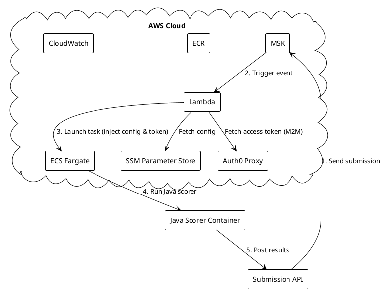

# Match Scorer Architecture

## Overview
The Match Scorer system processes submissions on-demand using AWS services. It uses a **fan-out architecture** with SNS, SQS, and per-challenge Lambda functions for scalable, asynchronous processing.

## Architecture Versions

### Current: Fan-Out Architecture (Recommended)
```
MSK → Router Lambda → SNS Topic → SQS Queues → Challenge Lambdas → ECS Tasks
                          ↓            ↓              ↓               ↓
                    [Validation]  [Per Challenge] [Cached Configs] [Tagged]
                                                                      ↓
                                  EventBridge ← ECS Task State Change
                                       ↓
                                  Completion Lambda → CloudWatch Logs
```

### Legacy: Direct Architecture (Deprecated)
```
MSK → Submission Watcher Lambda → ECS Tasks (synchronous)
```

---

## System Components

### 1. Event Source - MSK (Managed Streaming for Kafka)
- Receives submission events from the submission API
- Topic: `submission.notification.create`
- Triggers Router Lambda via Event Source Mapping

### 2. Router Lambda (`router-lambda`)
- **Trigger**: MSK Kafka events
- **Responsibilities**:
  - Decode base64 Kafka messages
  - Validate message structure (submissionId, challengeId must be valid UUIDs)
  - Check DynamoDB if challenge is active
  - Publish to SNS with `challengeId` message attribute for filtering
  - Report partial batch failures for retry

### 3. DynamoDB Table (`challenge-queue-mapping`)
- Stores challenge → queue mapping
- Schema:
  - `challengeId` (PK): Challenge UUID
  - `queueUrl`: SQS queue URL
  - `queueArn`: SQS queue ARN
  - `dlqUrl`: Dead Letter Queue URL
  - `challengeName`: Human-readable name
  - `active`: Boolean - whether routing is active

### 4. SNS Topic (`submission-fanout-topic`)
- Fan-out hub for submission messages
- Each SQS queue subscribes with filter policy on `challengeId`

### 5. SQS Queues (Per Challenge)
- One queue per challenge: `challenge-{name}-queue`
- Dead Letter Queue: `challenge-{name}-dlq`
- Configuration:
  - Visibility timeout: 120 seconds
  - Max receive count: 3 (before DLQ)
  - Message retention: 7 days (main), 14 days (DLQ)

### 6. Challenge Processor Lambda (`challenge-processor-lambda`)
- **Trigger**: SQS queue (one Lambda per challenge)
- **Key Features**:
  - **Cold-start config loading**: SSM configs cached at module initialization
  - **Token caching**: Auth0 token cached with expiry check
  - **Async ECS launch**: Fire-and-forget task launch
  - **Task tagging**: ECS tasks tagged for EventBridge correlation

### 7. ECS Fargate Task (Java Scorer)
- Runs the Java scorer container
- Tagged with: `ChallengeId`, `SubmissionId`, `ScorerType`
- Receives config and access token as environment variables

### 8. EventBridge Rule (`ecs-task-state-change-rule`)
- Triggers on ECS Task State Change (lastStatus: STOPPED)
- Routes to Completion Lambda

### 9. Completion Lambda (`completion-lambda`)
- **Trigger**: EventBridge ECS task state changes
- **Responsibilities**:
  - Extract task tags (ChallengeId, SubmissionId, ScorerType)
  - Log success/failure with exit code
  - (Future) Update submission status via API

### 10. Supporting Services
- **ECR**: Stores scorer container image
- **SSM Parameter Store**: Challenge and scorer configurations
- **Auth0 M2M Proxy**: Dynamic access token retrieval
- **CloudWatch Logs**: Centralized logging

## Architecture Diagram

### Fan-Out Architecture (Current)

```
┌─────────────────────────────────────────────────────────────────────────────┐
│                              AWS Cloud                                       │
│                                                                             │
│  ┌─────────┐    ┌──────────────┐    ┌─────────────┐    ┌────────────────┐  │
│  │   MSK   │───▶│Router Lambda │───▶│  SNS Topic  │───▶│  SQS Queues    │  │
│  │ (Kafka) │    │              │    │             │    │ (per challenge)│  │
│  └─────────┘    │ • Validate   │    │ • Fan-out   │    │ • With DLQs    │  │
│                 │ • Check DDB  │    │ • Filter by │    └───────┬────────┘  │
│                 │ • Publish    │    │   challengeId│            │          │
│                 └──────────────┘    └─────────────┘            ▼          │
│                        │                              ┌────────────────┐   │
│                        ▼                              │Challenge Proc. │   │
│                 ┌──────────────┐                      │    Lambdas     │   │
│                 │  DynamoDB    │                      │ • Cached config│   │
│                 │ (challenge   │                      │ • Token cache  │   │
│                 │   mapping)   │                      │ • Async ECS    │   │
│                 └──────────────┘                      └───────┬────────┘   │
│                                                               │            │
│  ┌─────────────┐    ┌──────────────┐    ┌─────────────┐      │            │
│  │  SSM Param  │◀───│    Auth0     │    │EventBridge  │◀─────┘            │
│  │   Store     │    │   Proxy      │    │   Rule      │                   │
│  └─────────────┘    └──────────────┘    └──────┬──────┘                   │
│         │                  │                    │                          │
│         ▼                  ▼                    ▼                          │
│  ┌──────────────────────────────────┐   ┌──────────────┐                  │
│  │         ECS Fargate Tasks        │   │ Completion   │                  │
│  │  • Tagged: ChallengeId,          │──▶│   Lambda     │                  │
│  │    SubmissionId, ScorerType      │   │ • Log status │                  │
│  │  • Java Scorer Container         │   │ • Track task │                  │
│  └──────────────────────────────────┘   └──────────────┘                  │
│                   │                                                        │
│                   ▼                                                        │
│           ┌─────────────┐                                                  │
│           │  Topcoder   │                                                  │
│           │     API     │                                                  │
│           └─────────────┘                                                  │
└─────────────────────────────────────────────────────────────────────────────┘
```

### Legacy Architecture (Deprecated)



## Data Flow (Fan-Out Architecture)

1. **Submission Event**
   - Submission API sends message to MSK topic `submission.notification.create`
   - Message contains: `submissionId`, `challengeId`, and other metadata

2. **Router Lambda Processing**
   - Decodes base64 Kafka message
   - Validates UUIDs (submissionId, challengeId)
   - Queries DynamoDB to check if challenge is active
   - Publishes to SNS with `challengeId` message attribute
   - Supports partial batch failure reporting

3. **Fan-Out Distribution**
   - SNS topic receives message
   - Filter policies route message to appropriate SQS queue based on `challengeId`
   - Each challenge has its own queue with DLQ for failed messages

4. **Challenge Processor Lambda**
   - Triggered by SQS queue (one Lambda per challenge)
   - Loads config from SSM (cached after cold start)
   - Gets Auth0 token (cached with expiry check)
   - Launches ECS task asynchronously (fire-and-forget)
   - Tags ECS task with: ChallengeId, SubmissionId, ScorerType

5. **ECS Task Execution (Java Scorer)**
   - ECS pulls Java scorer container from ECR
   - Runs scorer in Fargate mode
   - Downloads and scores submission
   - Posts results back to Topcoder API

6. **Task Completion Tracking**
   - EventBridge rule triggers on ECS task state change (STOPPED)
   - Completion Lambda extracts task tags and exit code
   - Logs success/failure to CloudWatch
   - (Future) Updates submission status via API

7. **Error Handling**
   - **Router Lambda**: Invalid messages skipped, inactive challenges ignored
   - **SQS**: Failed messages retry 3 times, then move to DLQ
   - **Challenge Processor**: Partial batch failure support
   - **ECS Tasks**: Failures logged via Completion Lambda
