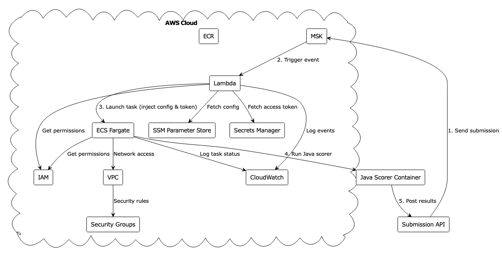
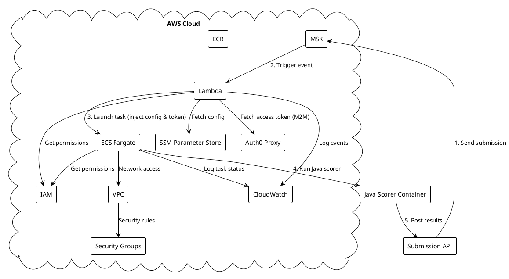

# Match Scorer Architecture

## Overview
The Match Scorer system is a POC designed to process submissions on-demand using AWS services. The system replaces the current EC2-based processor with a serverless architecture that uses Lambda and ECS to handle submission scoring.

## System Components

### 1. Event Source - MSK (Managed Streaming for Kafka)
- Receives submission events from the submission API
- Configured as an event source for Lambda
- Single broker configuration for simplicity

### 2. Submission Watcher Lambda
- Triggered by MSK events
- Responsible for:
  - Processing Kafka messages
  - Launching ECS tasks for scoring
  - Simple retry logic (configurable timeout and retry count)
  - Basic error handling and logging

### 3. ECS Fargate Task (Java Scorer)
- Runs the Java scorer container in Fargate mode
- Task Definition includes:
  - Container image from ECR
  - Receives config and access token as environment variables (from Lambda)
  - Loads challenge and scorer config from SSM (injected by Lambda)
  - Uses access token injected by Lambda (fetched via Auth0 M2M proxy)
  - IAM role for ECR, SSM, and submission API access
  - Network configuration

### 4. ECR (Elastic Container Registry)
- Stores the scorer container image
- Simple versioning

### 5. SSM Parameter Store
- Stores challenge and scorer configuration as JSON parameters
- Lambda fetches config from SSM and passes to ECS as environment variables

### 6. Auth0 M2M Proxy
- Lambda requests an access token at runtime using Auth0 client credentials via a proxy endpoint
- The token is injected into the ECS task environment as `ACCESS_TOKEN`

### 7. Scorer ECS Task Application (Java)
- Java application that:
  - Receives submission data and config
  - Downloads and extracts submission
  - Runs scoring logic for each phase as defined in config
  - Posts results (reviews) back to submission API
  - Cleans up after itself and logs all steps
  - All config is read from environment variables (injected from SSM by Lambda)
  - Access token is provided via Auth0 M2M proxy (injected by Lambda)

## Architecture Diagram

## Data Flow

1. **Submission Event**
   - Submission API sends message to MSK topic
   - Message contains submission details

2. **Lambda Processing**
   - Lambda receives event from MSK
   - Validates message format
   - Fetches challenge and scorer config from SSM Parameter Store
   - Fetches access token from Auth0 proxy (M2M)
   - Launches ECS task, injecting config and token as environment variables
   - Monitors task for configurable timeout (default 1 minute) to ensure it starts.
   - Retries launch up to configurable count (default 3) if the task doesn't appear to start quickly.
   - **Limitation:** This basic retry only checks for task *start*, not *completion* or *success*.

3. **ECS Task Execution (Java Scorer)**
   - ECS pulls Java scorer container from ECR
   - Runs scorer in Fargate mode
   - Java scorer loads config from environment (injected from SSM)
   - Java scorer uses access token (injected by Lambda)
   - Downloads and scores submission, posts results back to API

4. **Error Handling**
   - Lambda implements simple retry logic
   - Failed tasks are logged to CloudWatch
   - Basic error reporting
